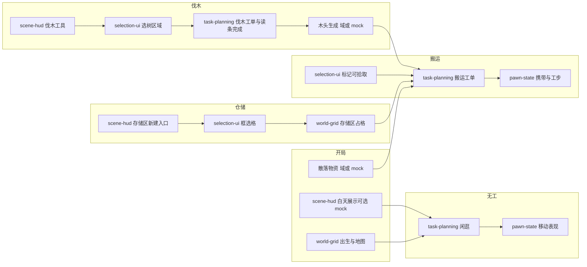

# 集成备注：环世界第一天（story-1，2026-04-05）

## 摘要

将 `oh-story/story-1.md` 译为可实现的跨系统流水线：世界布置（出生、白天、散落物）→ 闲逛 → 存储区划定 → 物资标记与搬运 → 伐木读条与产物 → 再搬运入存储区。主控条目见 `docs/ai/requests/2026-04-05-story-1-day-one.md`（R-01～R-10）。

## 端到端数据流（逻辑顺序）

## 系统交界说明

- **world-grid 与 selection-ui**：框选结果必须落在统一 `GridCoord` 约定上；存储区、待伐木树与可走格子冲突规则要在 domain 侧可以测试，不在场景内隐式猜测。
- **scene-hud 与 selection-ui**：工具模式（存储区新建、伐木、标记可拾取）切换时，选中集合与预览高亮应当一致重置或者继承规则写清楚。
- **task-planning 与 pawn-state**：工单派发、读条、完成回调应当通过明确状态迁移；避免场景直接修改「任务完成」而不经过规划层。
- **物资、树、木头**：如果现在仍然为 `mock-ground-items` 类数据，集成层应当登记「权威状态在场景」的临时边界，与 `requests` 文档中的 fake 或者 stub 一致。

## 待主 agent / 各系统 aidoc 拍板的事项

- 多个存储区并存时，搬运或者伐木产物的**默认落点**（最近、选中、主基地等）。
- 一棵树多名工人、一物多名工人同时搬运时的**确定性**或者**显式随机**策略。
- 「白天」是否绑定未来世界时钟，或者长期仅仅作为表现层。

## 与索引的后续动作（非本轮强制）

如果各个系统 aidoc 落地并且改变行为契约，应当更新 `docs/ai/index/system-index.json` 中相关 `integrationFiles` 或者 `latestAidocs` 引用（遵循 `push-with-aidoc` 工作流）。
