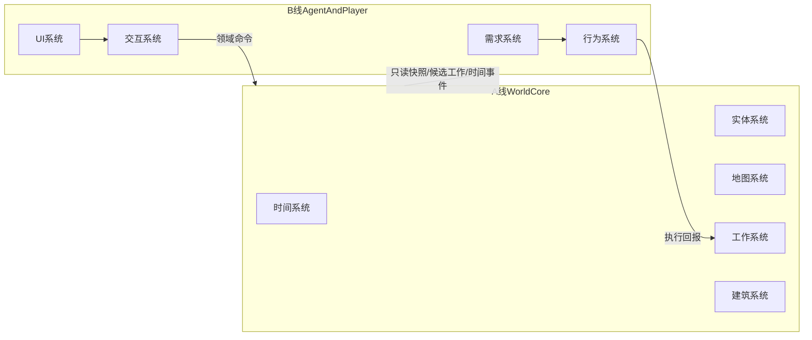

# 双人并行开发拆分方案

## 依据
本拆分以 [d:/CC/Twist-v1/oh-code-design/实体系统.yaml](d:/CC/Twist-v1/oh-code-design/实体系统.yaml)、[d:/CC/Twist-v1/oh-code-design/地图系统.yaml](d:/CC/Twist-v1/oh-code-design/地图系统.yaml)、[d:/CC/Twist-v1/oh-code-design/时间系统.yaml](d:/CC/Twist-v1/oh-code-design/时间系统.yaml)、[d:/CC/Twist-v1/oh-code-design/工作系统.yaml](d:/CC/Twist-v1/oh-code-design/工作系统.yaml)、[d:/CC/Twist-v1/oh-code-design/建筑系统.yaml](d:/CC/Twist-v1/oh-code-design/建筑系统.yaml)、[d:/CC/Twist-v1/oh-code-design/行为系统.yaml](d:/CC/Twist-v1/oh-code-design/行为系统.yaml)、[d:/CC/Twist-v1/oh-code-design/需求系统.yaml](d:/CC/Twist-v1/oh-code-design/需求系统.yaml)、[d:/CC/Twist-v1/oh-code-design/交互系统.yaml](d:/CC/Twist-v1/oh-code-design/交互系统.yaml)、[d:/CC/Twist-v1/oh-code-design/UI系统.yaml](d:/CC/Twist-v1/oh-code-design/UI系统.yaml) 为准。

文档显示三类依赖最强：
- `实体 + 地图` 共同维护位置、占用、覆盖格与实体生命周期一致性。
- `时间` 是 `需求 / 行为 / 工作 / UI` 的统一时间语义来源。
- `行为 + 需求 + 工作` 构成高频闭环，`交互 + UI` 则是玩家命令入口与只读表现出口。

因此不建议按单个子系统平均分给两个人，而应按“世界内核闭环”与“代理决策/玩家通道闭环”拆分。

## 推荐拆分
### A 线：世界内核与任务/建造闭环
负责人 A 聚焦底层真相源与任务管线，包含：
- [d:/CC/Twist-v1/oh-code-design/实体系统.yaml](d:/CC/Twist-v1/oh-code-design/实体系统.yaml)
- [d:/CC/Twist-v1/oh-code-design/地图系统.yaml](d:/CC/Twist-v1/oh-code-design/地图系统.yaml)
- [d:/CC/Twist-v1/oh-code-design/时间系统.yaml](d:/CC/Twist-v1/oh-code-design/时间系统.yaml)
- [d:/CC/Twist-v1/oh-code-design/工作系统.yaml](d:/CC/Twist-v1/oh-code-design/工作系统.yaml)
- [d:/CC/Twist-v1/oh-code-design/建筑系统.yaml](d:/CC/Twist-v1/oh-code-design/建筑系统.yaml)

职责边界：
- 定义世界状态的唯一真相源。
- 负责实体标识、位置、占用、覆盖格、蓝图、建筑、工作单、时间推进。
- 对外暴露稳定的只读快照、工作候选、建造结果与时间事件。

验收里程碑：
1. `A-M1 世界基底完成`
   - 有统一实体标识与实体快照。
   - 地图占用与实体位置保持一致。
   - 时间支持推进、暂停、调速、昼夜与跨天事件。
   - 验收标准：同一测试场景下，实体移动/创建/删除后，占用索引与实体状态无分裂；暂停状态下不存在隐式推进。
2. `A-M2 工作与建造闭环完成`
   - 可从标记/蓝图生成工作单。
   - 可处理领取、锁定、完成、失败与派生工作。
   - 蓝图可转建筑实体，并产出床铺归属等后续结果。
   - 验收标准：无需完整 AI，也能用命令回放或测试桩跑通 `标记 -> 工作生成 -> 执行结果 -> 实体/地图更新` 与 `蓝图 -> 建造 -> 建筑实体落地`。

### B 线：代理智能与玩家通道
负责人 B 聚焦行为决策与玩家操作入口，包含：
- [d:/CC/Twist-v1/oh-code-design/行为系统.yaml](d:/CC/Twist-v1/oh-code-design/行为系统.yaml)
- [d:/CC/Twist-v1/oh-code-design/需求系统.yaml](d:/CC/Twist-v1/oh-code-design/需求系统.yaml)
- [d:/CC/Twist-v1/oh-code-design/交互系统.yaml](d:/CC/Twist-v1/oh-code-design/交互系统.yaml)
- [d:/CC/Twist-v1/oh-code-design/UI系统.yaml](d:/CC/Twist-v1/oh-code-design/UI系统.yaml)

职责边界：
- 管理玩家输入到领域命令的转换。
- 管理需求压力、行为评分、状态机、打断规则与行为展示。
- 基于 A 线暴露的只读数据与命令接口完成编排，不直接持有世界真相源。

验收里程碑：
1. `B-M1 玩家命令通道完成`
   - UI 菜单、工具栏、模式提示与交互模式切换完整。
   - 选区、笔刷、单点放置都能生成统一领域命令。
   - 验收标准：可记录并重放命令流；模式进入、取消、退出无脏状态；UI 不直接判断领域可行性，只消费规则结果。
2. `B-M2 单小人决策闭环完成`
   - 需求可随时间与行为上下文演化。
   - 行为可综合需求、时间、地图、工作候选作出选择，并支持打断。
   - 验收标准：单小人在可控场景中能完成 `空闲 -> 领工作 -> 执行 -> 被饥饿/疲劳打断 -> 转向进食/休息 -> 恢复后重评`；行为标签与进度可供 UI 展示。

## 线间契约
两人正式开工前，先冻结下列接口；这一步是并行开发的共同里程碑。

`共享里程碑 S0：公共契约冻结`
- 实体标识与只读实体快照字段。
- 地图坐标、覆盖格集合、占用冲突返回值。
- 时间快照与时间事件格式。
- 工作单、工作步骤、工作锁定与完成回报格式。
- 交互命令格式，包括目标格集合、目标实体集合、来源模式。
- 需求到行为的优先级/紧急度/是否允许打断信号。

可用下图理解边界：

## 依赖顺序
- 两人可同时开始 `S0 公共契约冻结`。
- A 线完成 `A-M1` 后，B 线即可对接真实时间/地图/实体快照，不必继续完全依赖桩。
- B 线的 `B-M1` 不依赖 A 线完成全部任务，可先对接 mock 契约推进。
- A 线的 `A-M2` 与 B 线的 `B-M2` 可以并行推进，但要共享 `工作锁定` 与 `需求打断` 协议。

## 为什么这样拆最稳
- 把 `实体/地图/时间/工作/建筑` 放在同一人手里，可以避免位置、占用、蓝图、工作锁定被分散实现，降低一致性风险。
- 把 `行为/需求/交互/UI` 放在同一人手里，可以把“玩家发命令”和“小人怎么响应”收束到同一个编排面，减少来回对接。
- 两条线之间只保留 `命令 + 快照 + 工作/时间事件` 这条接缝，比按子系统均分更容易定义稳定接口与验收标准。

## 建议执行方式
- 先开一次短会，仅确认 `S0` 的字段与返回值，不讨论实现细节。
- 每条线都先交付一个“可回放、可脚本验证”的里程碑，而不是先追求完整画面。
- 联调时优先验证四条主链路：`伐木`、`拾取搬运`、`墙体/床铺建造`、`夜晚休息/需求打断`。
